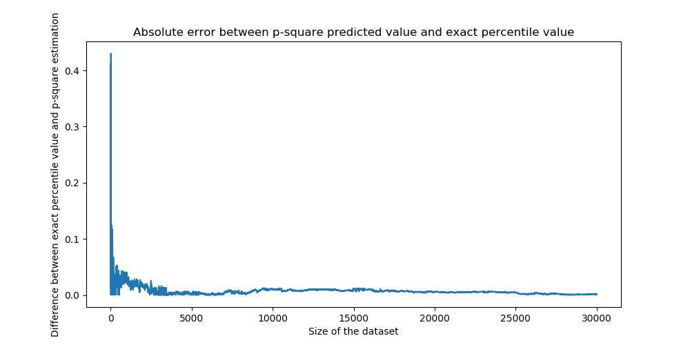
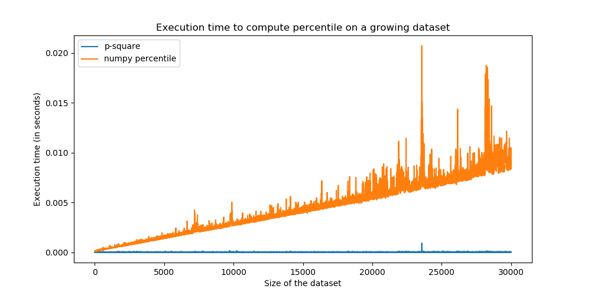

# Introduction

This is a python implementation of [this paper](https://www.cse.wustl.edu/~jain/papers/ftp/psqr.pdf), 
which proposes a heuristic algorithm for dynamic calculation of the median and other percentiles.
It has the advantage of running in O(1) at each iteration and is hence particularly useful when 
dealing with continuously (and fastly) incoming data.

# Install

1. From sources
    ```bash
    git clone git@gitlab.octo.com:bdalab/psquare.git
    cd psquare
    python setup.py install
    ```

2. Using pip
    ```bash
    pip install psquare
    ```
    
# Example of use

In the following example, we will estimate the value of the 95th percentile of a N(0,1) distribution
using p square algorithm. We will compare our estimates as we continuously draw from the distribution,
by comparing with the truth value given by the ````numpy.percentile```` function. At the end, we will plot
the residuals, and the execution time using psquare and ```numpy.percentile```.

```python
import numpy as np
import matplotlib
import matplotlib.pyplot as plt
import time

from psquare.psquare import PSquare

NB_ITERATIONS = 30000


def random_generator():
    return np.random.normal(0, 1, 1)


def exact_value_for_quantile(values, quantile):
    return np.percentile(values, quantile)


def main():
    values = [random_generator() for _ in range(5)]
    quantile_to_estimate = 95

    psquare = PSquare(quantile_to_estimate)
    exact_quantiles = []
    estimated_quantiles = []
    psquare_exec_time = []
    numpy_exec_time = []

    for val in values:  # p square algorithm necessitates 5 values to start
        psquare.update(val)

    for _ in range(NB_ITERATIONS):
        new_val = random_generator()
        values.append(new_val)

        psquare_start = time.time()
        psquare.update(new_val)
        estimated_quantiles.append(psquare.p_estimate())
        psquare_end = time.time()

        numpy_start = time.time()
        exact_quantiles.append(exact_value_for_quantile(values, quantile_to_estimate))
        numpy_end = time.time()

        psquare_exec_time.append(psquare_end - psquare_start)
        numpy_exec_time.append(numpy_end - numpy_start)

    matplotlib.rc('figure', figsize=(10, 5))
    errors = np.abs(np.array(estimated_quantiles) - np.array(exact_quantiles))
    plt.plot(errors)
    plt.title('Absolute error between p-square predicted value and exact percentile value')
    plt.ylabel('Difference between exact percentile value and p-square estimation')
    plt.xlabel('Size of the dataset')
    plt.rcParams["figure.figsize"] = (10, 5)
    plt.show()

    plt.plot(psquare_exec_time[1:], label='p-square')
    plt.plot(numpy_exec_time[1:], label='numpy percentile')
    plt.title('Execution time to compute percentile on a growing dataset')
    plt.ylabel('Execution time (in seconds)')
    plt.xlabel('Size of the dataset')
    plt.legend()
    plt.rcParams["figure.figsize"] = (10, 5)
    plt.show()


if __name__ == '__main__':
    main()
```

## Error between estimated and exact value

Using previous example we obtain the following figures:


* Errors between exact and predicted percentile value
    

* Execution time between p-square estimations and numpy _percentile_ function:
    